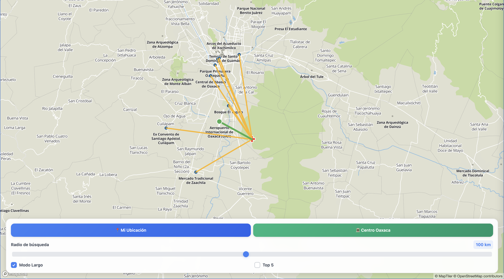

# 🏛️ CercaDeMiOaxaca

<p align="center">
  
</p>

<p align="center">
  <a href="https://oraisaias.github.io/CercaDeMiOaxaca/" target="_blank"><strong>🌐 Ver el sitio funcionando</strong></a>
</p>

## Descripción del Proyecto

**CercaDeMiOaxaca** es un mapa interactivo web que permite explorar y descubrir ubicaciones en el estado de Oaxaca, México. Es una herramienta de navegación geográfica que conecta puntos de interés con líneas de conexión visuales.

## 🌟 Características Principales

- **🌍 Mapa Interactivo:** Visualización de ubicaciones en Oaxaca con límites geográficos
- **📍 Puntos de Interés:** 70 ubicaciones personalizadas con información detallada
- **🔗 Conexiones Visuales:** Líneas que conectan el centro del mapa con los puntos más cercanos
- **📱 Panel Informativo:** Detalles de cada ubicación (nombre, ciudad, calle)
- **🔍 Búsqueda Externa:** Enlace directo a Google para más información
- **📍 Navegación:** Botones para ir a tu ubicación o al centro de Oaxaca
- **📱 Responsive:** Funciona perfectamente en móviles y desktop
- **⚡ Splash Screen:** Pantalla de carga profesional con animaciones

## 🛠️ Tecnologías Utilizadas

- **Mapbox GL JS:** Mapeo interactivo y visualización geográfica
- **Turf.js:** Análisis y cálculos geoespaciales
- **D3.js:** Manipulación de datos y visualizaciones
- **Tailwind CSS:** Diseño responsivo y moderno
- **HTML5/CSS3/JavaScript:** Tecnologías web estándar

## 📁 Estructura del Proyecto

```
mapa-html/
├── index.html              # Archivo principal HTML
├── styles.css              # Estilos CSS personalizados
├── script.js               # Lógica JavaScript del mapa
├── data/
│   └── mis-ubicaciones-filtrado.geojson  # Datos de ubicaciones (70 puntos)
└── README.md               # Este archivo
```

## 🚀 Instalación y Uso

### Requisitos Previos
- Navegador web moderno (Chrome, Firefox, Safari, Edge)
- Conexión a internet (para cargar librerías externas)

### Instalación
1. Clona o descarga el proyecto
2. Abre `index.html` en tu navegador web
3. ¡Listo! El mapa se cargará automáticamente

### Uso
- **Navegación:** Arrastra el mapa para moverte
- **Zoom:** Usa la rueda del mouse o gestos táctiles
- **Información:** Haz clic en cualquier punto o línea para ver detalles
- **Búsqueda:** Usa el botón "Buscar en Google" para más información
- **Ubicación:** Usa "Mi Ubicación" para ir a tu posición actual
- **Centro:** Usa "Centro Oaxaca" para volver al centro de la ciudad

## 🎯 Funcionalidades

### Mapa Interactivo
- Límites geográficos restringidos a Oaxaca
- Proyección 3D tipo globo
- Zoom y navegación suaves
- Puntos y líneas de conexión interactivos

### Panel de Información
- Detalles completos de cada ubicación
- Información de nombre, ciudad y calle
- Búsqueda directa en Google
- Diseño responsivo para móviles

### Navegación
- Botón de geolocalización personal
- Botón para centro de Oaxaca
- Transiciones suaves entre ubicaciones

## 📊 Datos

El proyecto utiliza un archivo GeoJSON personalizado con:
- **70 ubicaciones** en Oaxaca
- **Información detallada** de cada punto
- **Coordenadas precisas** para navegación
- **Propiedades estructuradas** para búsqueda y filtrado

## 🎨 Diseño

- **Interfaz moderna** con Tailwind CSS
- **Diseño responsivo** para todos los dispositivos
- **Animaciones suaves** y transiciones
- **Splash screen** profesional
- **Colores consistentes** con la marca

## 🌐 Compatibilidad

- ✅ Chrome (recomendado)
- ✅ Firefox
- ✅ Safari
- ✅ Edge
- ✅ Móviles (iOS/Android)

## 📱 Características Móviles

- **Diseño adaptativo** para pantallas pequeñas
- **Gestos táctiles** para navegación
- **Panel lateral** optimizado para móviles
- **Botones táctiles** de tamaño adecuado

## 🔧 Personalización

### Cambiar Datos
Para agregar o modificar ubicaciones:
1. Edita el archivo `data/mis-ubicaciones-filtrado.geojson`
2. Sigue el formato GeoJSON estándar
3. Incluye las propiedades: `shopName`, `address.city`, `address.streetName`

### Cambiar Estilos
- Modifica `styles.css` para cambios visuales
- Usa Tailwind CSS para estilos rápidos
- Personaliza colores y animaciones

## 📈 SEO Optimizado

- **Meta tags** completos para redes sociales
- **Structured data** para motores de búsqueda
- **Open Graph** para Facebook
- **Twitter Cards** para Twitter
- **Favicon** en múltiples tamaños

## 🤝 Contribuciones

Las contribuciones son bienvenidas. Para contribuir:
1. Fork el proyecto
2. Crea una rama para tu feature
3. Commit tus cambios
4. Push a la rama
5. Abre un Pull Request

## 📄 Licencia

Este proyecto está bajo la Licencia MIT. Ver el archivo LICENSE para más detalles.

## 👨‍💻 Autor

**CercaDeMiOaxaca** - Mapa interactivo para explorar Oaxaca

## 🙏 Agradecimientos

- Mapbox por las herramientas de mapeo
- Turf.js por el análisis geoespacial
- D3.js por las visualizaciones
- Tailwind CSS por el framework de diseño

---

**¡Explora la riqueza cultural de Oaxaca con CercaDeMiOaxaca!** 🏛️📍
